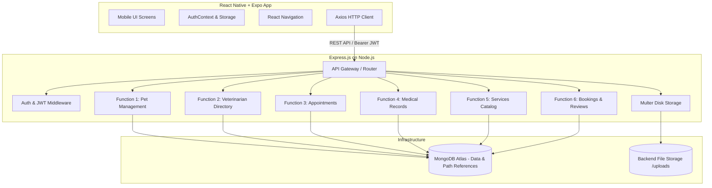

# PetCare — Pet Healthcare & Services Management Mobile Application

[](https://www.typescriptlang.org/)
[](https://nodejs.org/)
[](https://reactnative.dev/)
[](https://www.mongodb.com/atlas)

A full-stack mobile application written completely in **TypeScript** designed to streamline pet healthcare tracking, veterinary consultations, clinical record management, and service reservations.

---

## 📋 Table of Contents
1. [Project Overview](#project-overview)
2. [Technology Stack](#technology-stack)
3. [System Architecture](#system-architecture)
4. [Function Ownership & Structure](#function-ownership--structure)
5. [Repository File Structure](#repository-file-structure)
6. [Application & Authentication Workflow](#application--authentication-workflow)
7. [Installation & Setup](#installation--setup)
8. [Running Locally](#running-locally)
9. [API & Documentation Links](#api--documentation-links)
10. [Troubleshooting](#troubleshooting)

---

## 🐾 Project Overview

**PetCare** empowers pet owners to manage every aspect of their pets' health and daily care in one unified mobile platform:
- **Pet Owners:** Maintain detailed health profiles, schedule vet visits, track clinical records and prescriptions, book grooming sessions, and leave reviews.
- **Veterinarians:** Publish availability slots, manage appointments, and document examination diagnoses, medications, and vaccination records.
- **Service Providers / Admins:** Offer grooming, boarding, training, and walking services, and oversee reservations.

---

## 🛠 Technology Stack

### Mobile Frontend
- **Framework:** React Native (v0.73) with Expo (SDK 50)
- **Language:** TypeScript (`.ts`, `.tsx`) with strict type checking
- **Navigation:** React Navigation v6 (Stack & Bottom Tabs with typed parameters)
- **State Management:** React Context API (`AuthContext`)
- **HTTP Client:** Axios with token injection and automatic error interception
- **Storage:** `@react-native-async-storage/async-storage`
- **Media:** `expo-image-picker`

### Backend API
- **Runtime:** Node.js (v18+)
- **Framework:** Express.js (v4.18) with TypeScript
- **Database:** MongoDB Atlas with Mongoose ODM (v7)
- **Authentication:** JWT (JSON Web Tokens) with HTTP Bearer Authorization
- **Security:** bcryptjs password hashing, role-based authorization middleware
- **File Uploads:** Multer with local disk storage (`uploads/`), optional pet photos, zero binary in MongoDB
- **Validation:** Express-Validator with strict schema rules

---

## 🏛 System Architecture



---

## 👥 Function Ownership & Structure

The repository is strictly modularized across six distinct functional ownership areas plus common authentication:

| Function | Domain | Main Models | Primary Responsibilities |
|---|---|---|---|
| **Common** | Auth & Users | `User` | Registration, login, password hashing, JWT, profiles |
| **Function 1** | Pet Management | `Pet` | Pet profiles, breeds, photos, physical attributes |
| **Function 2** | Veterinarians | `Veterinarian` | Vet search, clinic information, schedule slots |
| **Function 3** | Appointments | `Appointment` | Booking visits, status workflow (pending ➔ confirmed ➔ completed) |
| **Function 4** | Medical Records | `MedicalRecord` | Clinical timeline, diagnoses, treatments, medications, vaccines |
| **Function 5** | Pet Services | `Service` | Service catalog (grooming, bathing, boarding), pricing |
| **Function 6** | Bookings & Reviews | `ServiceBooking`, `Review` | Service reservations, ratings (1-5 stars) and feedback |

---

## 📁 Repository File Structure

```text
PetCare/
├── README.md
├── TEAM_FUNCTION_PLAN.md
├── package.json
│
├── backend/
│   ├── package.json
│   ├── tsconfig.json
│   ├── .env.example
│   ├── tests/
│   │   └── health.test.ts
│   └── src/
│       ├── server.ts
│       ├── app.ts
│       ├── config/
│       │   └── database.ts
│       ├── middleware/
│       │   ├── authMiddleware.ts
│       │   ├── roleMiddleware.ts
│       │   ├── uploadMiddleware.ts
│       │   └── errorMiddleware.ts
│       ├── utils/
│       │   ├── generateToken.ts
│       │   └── response.ts
│       ├── types/
│       │   ├── express.d.ts
│       │   └── models.ts
│       ├── common/
│       │   └── authentication/
│       │       ├── user.model.ts
│       │       ├── auth.controller.ts
│       │       ├── auth.routes.ts
│       │       ├── auth.service.ts
│       │       └── auth.validation.ts
│       └── functions/
│           ├── function1-pets/
│           │   ├── pet.model.ts
│           │   ├── pet.controller.ts
│           │   ├── pet.routes.ts
│           │   ├── pet.service.ts
│           │   └── pet.validation.ts
│           ├── function2-veterinarians/
│           │   ├── veterinarian.model.ts
│           │   ├── veterinarian.controller.ts
│           │   ├── veterinarian.routes.ts
│           │   ├── veterinarian.service.ts
│           │   └── veterinarian.validation.ts
│           ├── function3-appointments/
│           │   ├── appointment.model.ts
│           │   ├── appointment.controller.ts
│           │   ├── appointment.routes.ts
│           │   ├── appointment.service.ts
│           │   └── appointment.validation.ts
│           ├── function4-medical-records/
│           │   ├── medicalRecord.model.ts
│           │   ├── medicalRecord.controller.ts
│           │   ├── medicalRecord.routes.ts
│           │   ├── medicalRecord.service.ts
│           │   └── medicalRecord.validation.ts
│           ├── function5-services/
│           │   ├── service.model.ts
│           │   ├── service.controller.ts
│           │   ├── service.routes.ts
│           │   ├── service.service.ts
│           │   └── service.validation.ts
│           └── function6-bookings-reviews/
│               ├── serviceBooking.model.ts
│               ├── serviceBooking.controller.ts
│               ├── serviceBooking.routes.ts
│               ├── serviceBooking.service.ts
│               ├── review.model.ts
│               ├── review.controller.ts
│               ├── review.routes.ts
│               ├── review.service.ts
│               └── validation/
│                   ├── bookingValidation.ts
│                   └── reviewValidation.ts
│
├── frontend/
│   ├── package.json
│   ├── tsconfig.json
│   ├── app.json
│   ├── babel.config.js
│   ├── .env.example
│   ├── App.tsx
│   └── src/
│       ├── constants/
│       │   ├── colors.ts
│       │   └── config.ts
│       ├── types/
│       │   ├── api.ts
│       │   ├── models.ts
│       │   └── navigation.ts
│       ├── utils/
│       │   ├── storage.ts
│       │   └── formatDate.ts
│       ├── services/
│       │   ├── api.ts
│       │   └── authService.ts
│       ├── context/
│       │   └── AuthContext.tsx
│       ├── components/
│       │   └── common/
│       │       ├── Button.tsx
│       │       ├── Input.tsx
│       │       ├── Card.tsx
│       │       ├── Loading.tsx
│       │       └── Badge.tsx
│       ├── navigation/
│       │   ├── AuthNavigator.tsx
│       │   ├── MainTabNavigator.tsx
│       │   └── RootNavigator.tsx
│       ├── screens/
│       │   ├── auth/
│       │   │   ├── LoginScreen.tsx
│       │   │   └── RegisterScreen.tsx
│       │   ├── home/
│       │   │   └── HomeScreen.tsx
│       │   └── profile/
│       │       └── ProfileScreen.tsx
│       └── functions/
│           ├── function1-pets/
│           │   ├── services/petService.ts
│           │   └── screens/
│           │       ├── PetListScreen.tsx
│           │       ├── PetDetailScreen.tsx
│           │       ├── AddPetScreen.tsx
│           │       └── EditPetScreen.tsx
│           ├── function2-veterinarians/
│           │   ├── services/vetService.ts
│           │   └── screens/
│           │       ├── VetListScreen.tsx
│           │       └── VetDetailScreen.tsx
│           ├── function3-appointments/
│           │   ├── services/appointmentService.ts
│           │   └── screens/
│           │       ├── AppointmentListScreen.tsx
│           │       ├── BookAppointmentScreen.tsx
│           │       └── AppointmentDetailScreen.tsx
│           ├── function4-medical-records/
│           │   ├── services/medicalRecordService.ts
│           │   └── screens/
│           │       ├── MedicalRecordListScreen.tsx
│           │       ├── MedicalRecordDetailScreen.tsx
│           │       └── AddMedicalRecordScreen.tsx
│           ├── function5-services/
│           │   ├── services/serviceService.ts
│           │   └── screens/
│           │       ├── ServiceListScreen.tsx
│           │       └── ServiceDetailScreen.tsx
│           └── function6-bookings-reviews/
│               ├── services/
│               │   ├── bookingService.ts
│               │   └── reviewService.ts
│               └── screens/
│                   ├── BookServiceScreen.tsx
│                   ├── MyBookingsScreen.tsx
│                   └── AddReviewScreen.tsx
│
└── docs/
    ├── API_ENDPOINTS.md
    ├── DATABASE_SCHEMA.md
    ├── SYSTEM_ARCHITECTURE.md
    ├── APPLICATION_WORKFLOW.md
    └── DEPLOYMENT.md
```

---

## ⚡ Installation & Setup

### Prerequisites
- [Node.js](https://nodejs.org/) v18 or higher
- [npm](https://www.npmjs.com/)
- [Expo Go app](https://expo.dev/client) installed on your iOS/Android phone
- MongoDB Atlas cluster URL

### 1. Clone the Repository
```bash
git clone https://github.com/Dilshan-Pasindu/Pet-Care.git
cd Pet-Care
```

### 2. Backend Setup
```bash
cd backend
cp .env.example .env
# Edit .env with your MongoDB Atlas connection string and JWT secret
npm install
```

### 3. Frontend Setup
```bash
cd ../frontend
cp .env.example .env
# Set EXPO_PUBLIC_API_URL to your backend URL (e.g., http://<YOUR_IP>:5000/api)
npm install
```

---

## 🚀 Running Locally

### Start Backend
```bash
cd backend
npm run dev
```
The server will start on `http://localhost:5000`. Health check endpoint: `http://localhost:5000/api/health`.

### Start Frontend (Expo)
```bash
cd frontend
npx expo start
```
- Press **i** for iOS Simulator
- Press **a** for Android Emulator
- Scan the QR code with **Expo Go** on your physical iPhone or Android device

---

## 📚 Documentation
- [Team Development Plan (TEAM_FUNCTION_PLAN.md)](./TEAM_FUNCTION_PLAN.md)
- [API Endpoints Reference (docs/API_ENDPOINTS.md)](./docs/API_ENDPOINTS.md)
- [Database Schema (docs/DATABASE_SCHEMA.md)](./docs/DATABASE_SCHEMA.md)
- [System Architecture (docs/SYSTEM_ARCHITECTURE.md)](./docs/SYSTEM_ARCHITECTURE.md)
- [Application Workflow (docs/APPLICATION_WORKFLOW.md)](./docs/APPLICATION_WORKFLOW.md)
- [Deployment Guide (docs/DEPLOYMENT.md)](./docs/DEPLOYMENT.md)

---

## 🛡 Security & Best Practices
- Passwords are encrypted using bcrypt with salt rounds of 10.
- Passwords are excluded (`select: false`) from queries.
- Protected routes require Bearer JWT authorization tokens.
- Role-based authorization ensures owners, veterinarians, and admins only access permitted endpoints.
- Strict input validation prevents parameter pollution and injection attacks.
