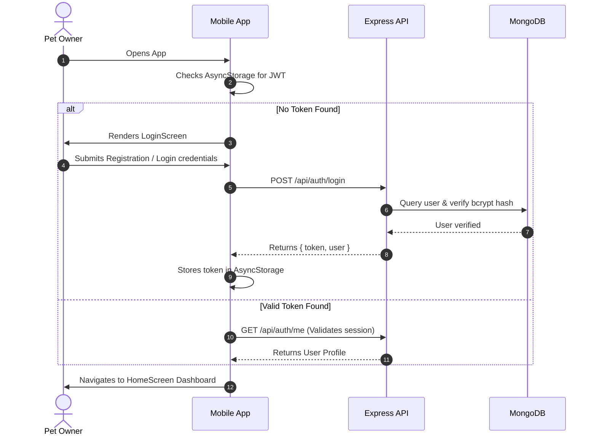
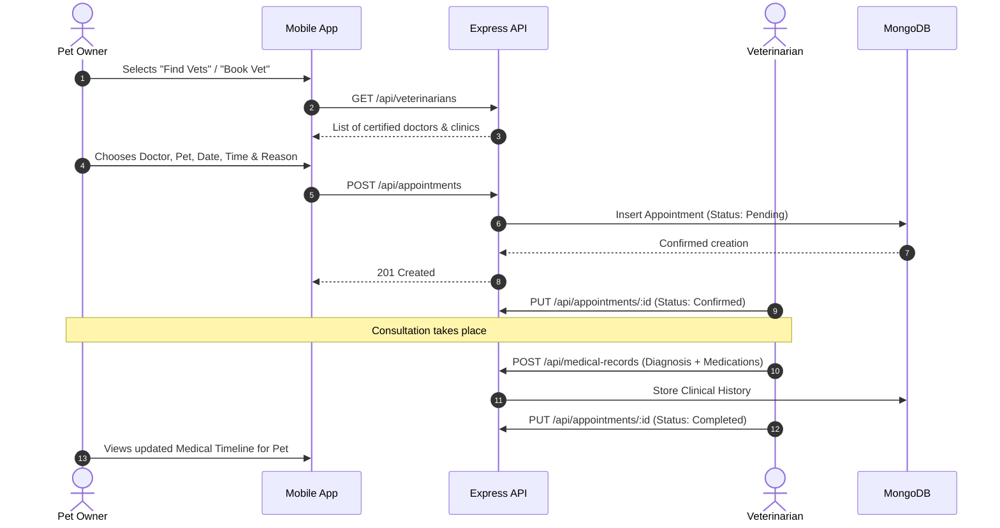
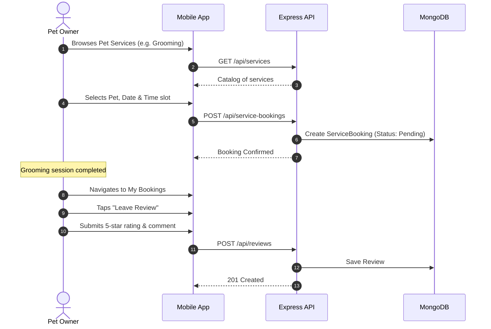

# PetCare — Application Workflow & User Journeys

This document illustrates the end-to-end user workflows from onboarding to clinical and service bookings.

---

## 1. User Onboarding & Authentication Journey

---

## 2. Veterinary Consultation Workflow

---

## 3. Pet Service Booking & Review Flow

