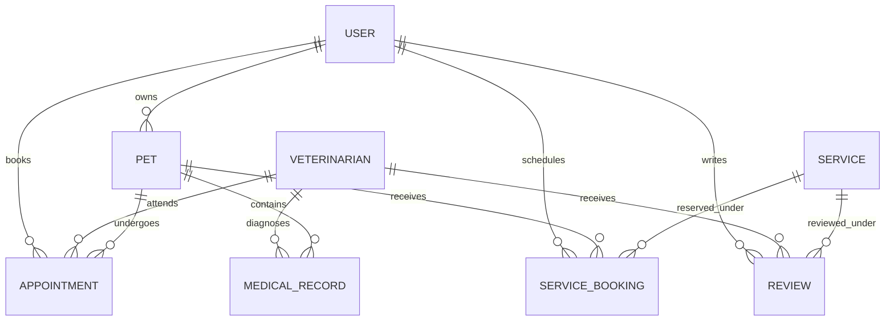

# PetCare — MongoDB Database Schema & Entity Relationships

The application runs on **MongoDB Atlas** managed through **Mongoose ODM**. Below is the entity relationship architecture and schema definitions.

---

## 🗺 Entity Relationship Diagram

---

## 📑 Collection Specifications

### 1. `users`
- `_id`: ObjectId (Primary Key)
- `name`: String (Required, trimmed)
- `email`: String (Required, unique, lowercase)
- `password`: String (Required, bcrypt hashed, `select: false`)
- `phone`: String (Optional)
- `role`: String (Enum: `'owner'`, `'veterinarian'`, `'admin'`, default: `'owner'`)
- `profileImage`: String (Optional URL)
- `createdAt` / `updatedAt`: Date (Timestamps)

### 2. `pets`
- `_id`: ObjectId (Primary Key)
- `ownerId`: ObjectId (Ref: `User`, Required, Indexed)
- `name`: String (Required, trimmed)
- `species`: String (Required)
- `breed`: String (Optional)
- `gender`: String (Enum: `'male'`, `'female'`, Required)
- `dateOfBirth`: Date (Optional)
- `weight`: Number (Optional)
- `description`: String (Optional)
- `image`: String (Optional URL)
- `createdAt` / `updatedAt`: Date (Timestamps)

### 3. `veterinarians`
- `_id`: ObjectId (Primary Key)
- `userId`: ObjectId (Ref: `User`, Optional)
- `name`: String (Required)
- `specialization`: String (Required)
- `qualification`: String (Required)
- `experience`: Number (Required)
- `clinicName`: String (Required)
- `phone`: String (Required)
- `location`: String (Required)
- `consultationFee`: Number (Required, Min: 0)
- `availability`: Array of Embedded Subdocuments:
  - `day`: String (e.g. `'Monday'`)
  - `startTime`: String (e.g. `'09:00 AM'`)
  - `endTime`: String (e.g. `'05:00 PM'`)
  - `isAvailable`: Boolean (Default: `true`)
- `profileImage`: String (Optional URL)
- `description`: String (Optional)
- `createdAt` / `updatedAt`: Date (Timestamps)

### 4. `appointments`
- `_id`: ObjectId (Primary Key)
- `petId`: ObjectId (Ref: `Pet`, Required, Indexed)
- `ownerId`: ObjectId (Ref: `User`, Required, Indexed)
- `veterinarianId`: ObjectId (Ref: `Veterinarian`, Required, Indexed)
- `date`: Date (Required)
- `time`: String (Required)
- `reason`: String (Required)
- `status`: String (Enum: `'pending'`, `'confirmed'`, `'completed'`, `'cancelled'`, Default: `'pending'`)
- `notes`: String (Optional)
- `createdAt` / `updatedAt`: Date (Timestamps)

### 5. `medicalrecords`
- `_id`: ObjectId (Primary Key)
- `petId`: ObjectId (Ref: `Pet`, Required, Indexed)
- `veterinarianId`: ObjectId (Ref: `Veterinarian`, Required, Indexed)
- `appointmentId`: ObjectId (Ref: `Appointment`, Optional)
- `diagnosis`: String (Required)
- `treatment`: String (Optional)
- `medications`: Array of Embedded Objects:
  - `name`: String (Required)
  - `dosage`: String (Required)
  - `frequency`: String (Required)
  - `duration`: String (Required)
- `vaccination`: Embedded Object (Optional):
  - `vaccineName`: String
  - `dateGiven`: Date
  - `nextDueDate`: Date
  - `batchNumber`: String
- `notes`: String (Optional)
- `recordDate`: Date (Default: `Date.now`)
- `createdAt` / `updatedAt`: Date (Timestamps)

### 6. `services`
- `_id`: ObjectId (Primary Key)
- `name`: String (Required)
- `description`: String (Optional)
- `category`: String (Enum: `'Grooming'`, `'Bathing'`, `'Nail Trimming'`, `'Training'`, `'Boarding'`, `'Walking'`, `'Other'`)
- `price`: Number (Required, Min: 0)
- `duration`: Number (Required in minutes)
- `provider`: String (Optional)
- `availability`: Boolean (Default: `true`)
- `image`: String (Optional URL)
- `createdAt` / `updatedAt`: Date (Timestamps)

### 7. `servicebookings`
- `_id`: ObjectId (Primary Key)
- `userId`: ObjectId (Ref: `User`, Required, Indexed)
- `petId`: ObjectId (Ref: `Pet`, Required)
- `serviceId`: ObjectId (Ref: `Service`, Required, Indexed)
- `date`: Date (Required)
- `time`: String (Required)
- `status`: String (Enum: `'pending'`, `'confirmed'`, `'completed'`, `'cancelled'`, Default: `'pending'`)
- `notes`: String (Optional)
- `createdAt` / `updatedAt`: Date (Timestamps)

### 8. `reviews`
- `_id`: ObjectId (Primary Key)
- `userId`: ObjectId (Ref: `User`, Required, Indexed)
- `veterinarianId`: ObjectId (Ref: `Veterinarian`, Optional, Indexed)
- `serviceId`: ObjectId (Ref: `Service`, Optional, Indexed)
- `rating`: Number (Required, 1 to 5)
- `comment`: String (Optional)
- `createdAt` / `updatedAt`: Date (Timestamps)
